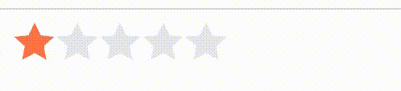
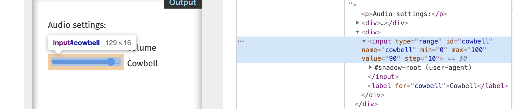
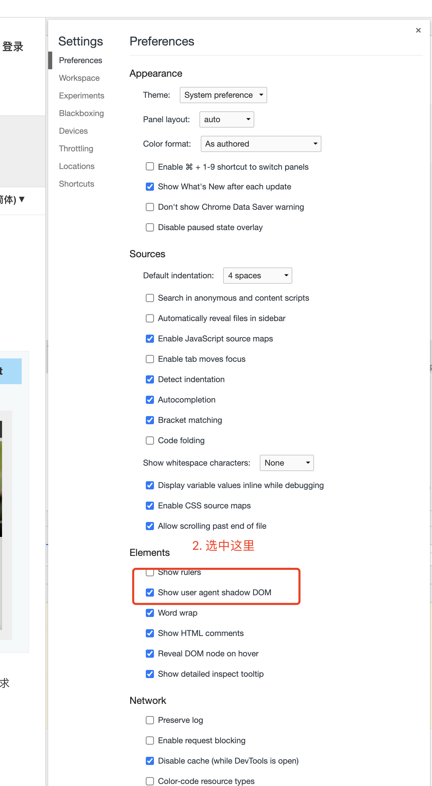

## 为啥会有用css实现评分想法？
### 需求描述
pc端鼠标点击进行评分，移动端手指移动评分



像上面这种评分是一种很常见的需求，借助js实现的很简单，但是css的话就会有一点点的难度

### 背景 
那天[张老师](https://www.zhangxinxu.com/wordpress/)在code review 我代码，看到评星实现的时候，提了一嘴 借助`type="range"`应该可以实现，当时的我想破脑袋也想不出来，脑子是蒙的。后来[同事](https://github.com/XboxYan)无意间看到了我的博客，开始了一段新的对话


后来我和他各种忙各自的去了，再后来纯css实现了


震惊，这也太厉害了吧，只有你想不到，没有你实现不了的。我们先看看来看看效果

[纯css实现评分](https://codepen.io/qingchuang/pen/jOMmQab)

同事他说之前想自定义input range的样式研究过，没想到这次派上用场了。真的太厉害了，打开了我的眼界


## 如何用css实现评分
在DOM结构里面有一种特殊的DOM叫 shaow DOM，
### input type="range" 只是一个简单的元素吗？



惊奇的发现原来 `input type="range"` 元素里面是包含了其他的元素的，只是平常的时候我们见不着，他是被隐藏起来，并不是没有。那我们怎么让他显示出来。



我们做的一个小小的设置就是把 shaow DOM 显示出来，心细的小伙伴发现`input type="range"`标签下面有一个 `shadow-root`  节点。节点里面就有很多的dom节点，证实了`input type="range"`并不是一个标签，而是一个组件，只是组件内的东西，不允许我们改变，我们不容易看见。我们给他取一个名字，影子节点

### 如何自定义`input type="range"`的样式
像这种元素我们可以称之为组件，Web components 的一个重要属性是封装——可以将标记结构、样式和行为隐藏起来，并与页面上的其他代码相隔离，保证不同的部分不会混在一起，可使代码更加干净、整洁。其中，Shadow DOM 接口是关键所在，它可以将一个隐藏的、独立的 DOM 附加到一个元素上。`input type="range"` 就是一个 web components 。
[ shadow DOM ](https://developer.mozilla.org/zh-CN/docs/Web/Web_Components/Using_shadow_DOM)里面的内容不被我们所见

有了上面的知识点，接下来我们就可以研究如何去自定义他的样式。通过浏览器调试工具我们不难发现暴露了一个伪类供我们修改。是不是我们对他的伪类进行修改就可以实现自定义样式呢？

通过文档查找我们发现了[::-webkit-slider-runnable-track](https://developer.mozilla.org/zh-CN/docs/Web/CSS/::-webkit-slider-runnable-track)和[::-webkit-slider-thumb](https://developer.mozilla.org/zh-CN/docs/Web/CSS/::-webkit-slider-thumb)修改

到此我们的问题解决80%了，现在就剩下怎么用图案去覆盖原有的背景色。脑子灵感一闪[-mask-masks](https://www.zhangxinxu.com/wordpress/2017/11/css-css3-mask-masks/)

问题解决了，我们要的实现效果实现了，在谷歌浏览器里面没有任何问题，很完美

```
<input type="range" name="star" min="0" max="5" step="0.5" value="0">

<input type="range" name="star" min="0" max="5" step="0.5">
input[type="range"]{
      -webkit-appearance: none;
      width: 100px;
      margin: 0;
      outline: 0;
  }
  input[type="range" i]::-webkit-slider-runnable-track {
      background: coral;
      height: 20px;
      -webkit-mask: url("data:image/svg+xml,%3Csvg width='12' height='11' viewBox='0 0 12 11' fill='none' xmlns='http://www.w3.org/2000/svg'%3E%3Cpath d='M6 0l1.693 3.67 4.013.476L8.74 6.89l.788 3.964L6 8.88l-3.527 1.974.788-3.964L.294 4.146l4.013-.476L6 0z' fill='%23F67600'/%3E%3C/svg%3E");
      -webkit-mask-size: 20px;
      -webkit-mask-repeat: repeat-x;
  }
  input[type="range" i]::-webkit-slider-thumb {
      -webkit-appearance: none;
      width: 0;
      height: 100%;
      box-shadow: 999px 0px 0px 999px #E8EAED;
  }
```

纯css实现了，不需要js，我的同事真厉害。只要兼容 `input type="range"` 这个问题就不大了。

### 其他的浏览器兼容性怎么样呢？
火狐浏览器：通过控制台不难发现，结构是一样的，只是暴露的伪类不一样，稍微修改就好了

```
  input[type=range]{
      -webkit-mask: url("data:image/svg+xml,%3Csvg width='12' height='11' viewBox='0 0 12 11' fill='none' xmlns='http://www.w3.org/2000/svg'%3E%3Cpath d='M6 0l1.693 3.67 4.013.476L8.74 6.89l.788 3.964L6 8.88l-3.527 1.974.788-3.964L.294 4.146l4.013-.476L6 0z' fill='%23F67600'/%3E%3C/svg%3E");
      -webkit-mask-size: 20px;
      -webkit-mask-repeat: repeat-x;
      height: 20px;
  }
  input[type=range]::-moz-range-track{
      background: #E8EAED;
      height: inherit;
  }
  input[type=range]::-moz-range-progress {
      background: coral;
      height: inherit;
  }
  input[type=range]::-moz-range-thumb {
      width: 0;
      opacity: 0;
  }
```

用法就是他的原生用法，没有上手的难度

## 总结

我的同事们脑子里装一定是的百科全书，仿佛就没有他们不知道的东西。好几次都找同事帮忙看问题解决问题，他们的脑袋转悠转悠，贼快的给出了我要的答案，那速度比谷歌还快。真开心，真羡慕自己有一群这样的同事。以后做需求写功能都可以像他们取经，是否有更好的实现方式，交流讨论，然后成长。选择比努力重要，特别是遇到了一群大佬同事。

年底了，你们不用羡慕我，你值得拥有，来试一试我公司吧,了解一下[我们的学院日常](https://story.yux.team/#&202012)，每个月都有活动哟，可以年前面试年后入职，没有996，没有大小周，想加班都未必会批。

无论你的技术栈偏前还是偏后，都有合适你的位置。欢迎简历至 zhangmin.a@yuewen.com，工作地点：上海浦东微电子港，本科以上学历，2年以上工作经验，简历必回。


